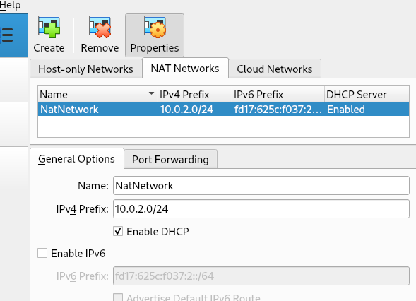

## Setup vm Virtualbox


**1. Ubuntu server 20.04**

**2. 1 core + 512mb ram + 25gb storage**

**3. Network adapter**

- B1: Khởi tạo NAT + Host-only Networks:

    
    
    

- B2: Tạo network adapter trên vm:

    

- B3 Setup khi clone vm:

    `Chú ý:` đổi ip address của `Adapter 3 (Host-only Adapter)` sau khi clone:
    ```bash
    sudo nano /etc/netplan/00-installer-config.yaml
    sudo netplan apply
    sudo netplan try
    ```

    Example of `00-installer-config.yaml`
    ```yaml
    # This is the network config written by 'subiquity'
    network:
        ethernets:
            enp0s3:
                dhcp4: true
            enp0s8:
                dhcp4: true
            enp0s9:
                dhcp4: false
                addresses: [192.168.56.6/24]
        version: 2
    ```

**4. Profile setup**


- `Your name`: lab
- `Your server's name`: base
    
    Lần đầu tạo đặt là `base` - full clone các máy khác từ vm này

    Mỗi vm sẽ chạy 1 UPF hoặc 1 cặp GNB + UE.
    - Máy UPF: tên là `upf`
    - Máy GNB + UE: tên là `gnbue`

    Cách đổi tên sau khi clone.
    ```bash
    sudo nano /etc/hosts
    sudo nano /etc/hostname
    ```

- `Pick a username`: vd
- `Choose a password`: 1

**5. Update and install requirement pkg**

- [Đọc file setup mẫu](./setup_UBUNTU_SERVER.sh)

- Copy file to vm:

    ```bash
    cd ~
    sudo nano setup.sh
    # copy nội dung file trên vào
    chmod +x setup.sh

    ./setup.sh
    ```

- Nếu muốn cài free5gc + ueransim thì bỏ dấu comment ở [file](./setup_UBUNTU_SERVER.sh). 

- Clone etrib5gc.

- Chép [folder run](./run/) vào etrib5gc.